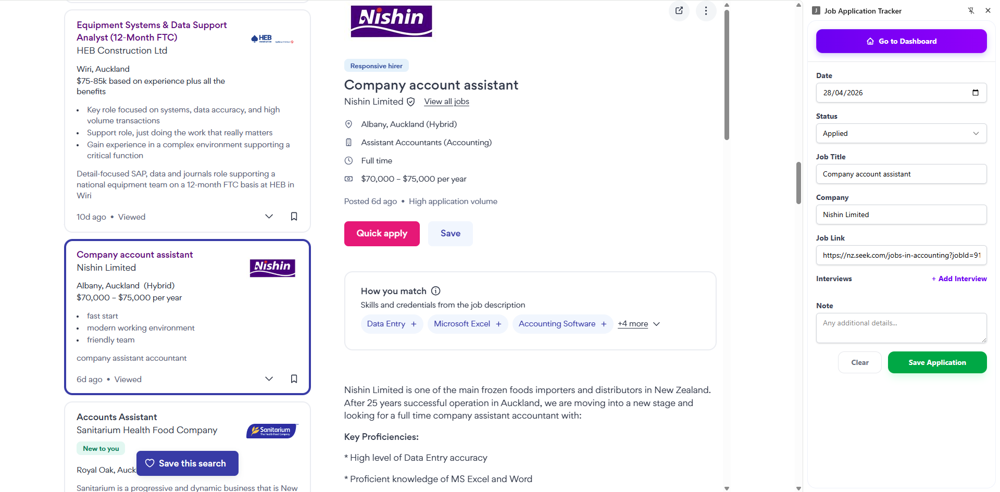
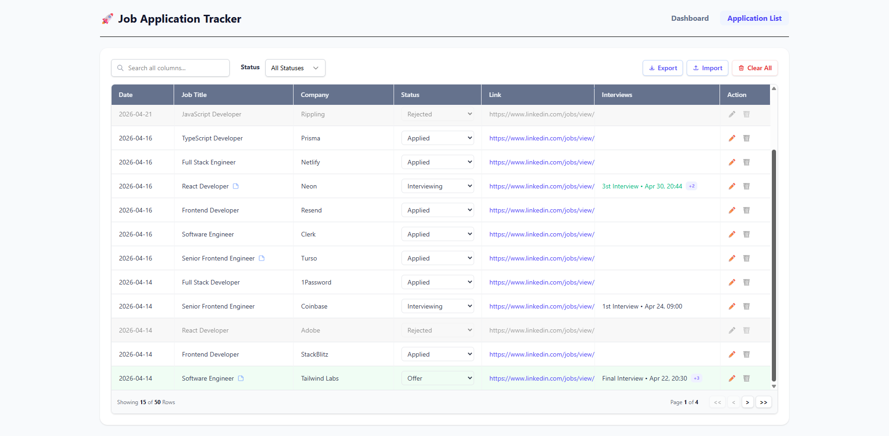
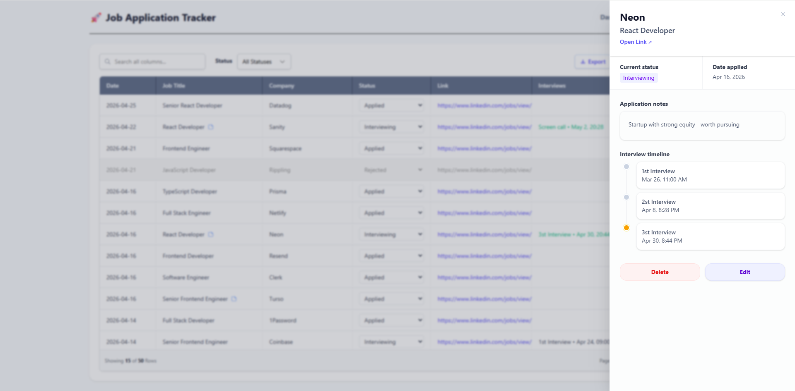
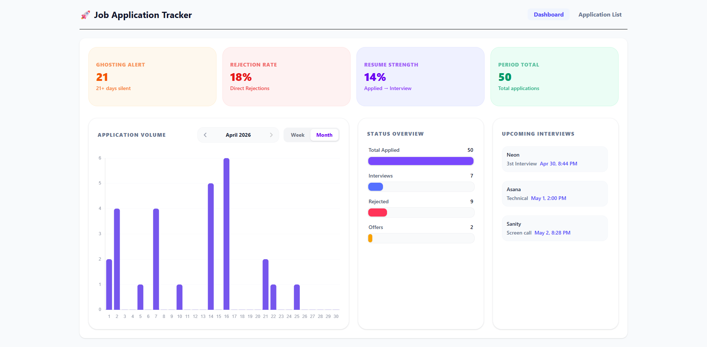

# Job Application Tracker

A Chrome extension that helps you track your job search — automatically captures job listings as you browse and gives you a dashboard to analyze your progress.

---

## Features

### Auto-Capture from Job Sites

The extension runs silently in the background on supported job boards. When you view a job listing, it automatically extracts the job title, company, and link — no copy-pasting needed. Supported sites include LinkedIn, Indeed, Glassdoor, Seek (AU/NZ), and most ATS platforms (Workday, Greenhouse, Lever, etc.).

### Side Panel

Click the extension icon to open a side panel. It pre-fills a form with the job data extracted from the current page. Review and submit with one click, or edit any field before saving. The panel shows color-coded alerts for success, errors, warnings, and duplicate detection.



### Applications Table

A full-featured table of all tracked applications with:

- Global search and filter by status
- Sortable columns with direction indicators
- Inline status updates via dropdown
- Rejected and offer rows visually emphasized
- Note indicator icon on job title when notes are present
- Interview preview — shows next upcoming or most recent interview per row, with active interviews highlighted in green
- Click any row to open the **Detail Sidebar**

### CSV Import/Export

- **Export** generates a UTF-8 BOM CSV file (compatible with Excel) named `jobs_applications_export_YYYY-MM-DD.csv`
- **Import** maps CSV headers back to fields, skips duplicates within the batch and against existing data (matched by `jobId`)

---



### Detail Sidebar

A slide-in drawer that opens when you click a table row, showing:

- Company name, job title, and clickable job link
- Current status badge
- Application date and notes
- **Interview timeline** — vertical timeline with past (gray) and upcoming (amber) interviews, each showing type and date/time
- Edit and Delete actions

### Interview Tracking

Each application can store multiple scheduled interviews. Per interview:

- Type (e.g. "1st Interview", "Technical", "HR")
- Date and time



### Dashboard Analytics

Visual overview of your job search health:

- **Period Total** — total applications in the selected period
- **Ghosting Alert** — applications with "Applied" status that are 21+ days old
- **Rejection Rate** — percentage of rejected applications
- **Resume Strength** — interview-to-application conversion rate
- **Volume Chart** — bar chart of daily application counts with weekly/monthly view and period navigation
- **Status Funnel** — visual pipeline from Total Applied → Interviews → Rejected → Offers
- **Upcoming Schedule** — next 3–5 upcoming interviews with company, type, and date/time


---

## How It Works

```
Job Listing Page
      │
      ▼
Content Script (content.ts)
  - Observes DOM mutations & URL changes via MutationObserver
  - Main frame attempts extraction first (JSON-LD → CSS selectors)
  - On failure, delegates to same-origin iframes (e.g. LinkedIn detail pane)
  - Sends JOB_UPDATED message when title + company are found
      │
      ▼
Background Service Worker (background.ts)
  - Receives JOB_UPDATED from content script
  - Deduplicates by jobId to prevent repeated relays
  - Relays data to side panel
  - Persists saves to chrome.storage.local
      │
      ▼
Side Panel / Dashboard (React UI)
  - Displays extracted data for review
  - Manages form submission
  - Reads stored applications for table & charts
```

**Extraction priority (per frame):**

1. JSON-LD structured data (`<script type="application/ld+json">`) — most reliable
2. Site-specific CSS selectors — for LinkedIn, Seek, Glassdoor, Indeed
3. Generic fallbacks — `<h1>`, canonical link, `data-automation` attributes

All data is stored locally in your browser via `chrome.storage.local`. There is no backend, no account, and no data sent anywhere.

---

## Tech Stack

| Layer         | Technology                 |
| ------------- | -------------------------- |
| UI Framework  | React 19 + TypeScript      |
| Build Tool    | Vite 8                     |
| Styling       | Tailwind CSS 4             |
| Table         | TanStack Table v8          |
| Charts        | Chart.js + react-chartjs-2 |
| Forms         | react-hook-form            |
| CSV           | PapaParse                  |
| Dates         | Day.js                     |
| Notifications | react-hot-toast            |
| Extension API | Chrome Manifest V3         |

---

## Project Structure

```
src/
├── background.ts          # Service worker — message relay, deduplication, tab management
├── content.ts             # Content script — DOM extraction, URL change detection, iframe delegation
├── pages/
│   ├── sidepanel/         # Side panel entry point and UI
│   ├── applications/
│   │   ├── Applications.tsx     # Applications page root
│   │   ├── Table.tsx            # Table with search, filter, sort, pagination
│   │   ├── Columns.tsx          # Column definitions and interview display logic
│   │   ├── DetailsSidebar.tsx   # Slide-in detail drawer with interview timeline
│   │   ├── EditModal.tsx        # Edit application modal
│   │   └── CsvService.ts        # CSV import/export logic
│   ├── dashboard/
│   │   ├── Dashboard.tsx        # Dashboard layout and metric calculations
│   │   ├── MetricCard.tsx       # KPI cards (ghosting, rejection rate, etc.)
│   │   ├── VolumeChart.tsx      # Bar chart with period navigation
│   │   ├── FunnelStep.tsx       # Status funnel visualization
│   │   ├── UpcomingSchedule.tsx # Upcoming interview list
│   │   └── constants.ts         # Metric and funnel configuration
│   └── common/
│       ├── Header.tsx           # Shared navigation header
│       └── JobForm.tsx          # Shared form (side panel, edit modal, detail sidebar)
├── hooks/
│   └── useApplications.ts # Custom hook — reads from Chrome storage with live updates
├── utils/
│   ├── extractors.ts      # Job page detection, CSS selector strategies, JSON-LD parsing
│   └── jobUtils.ts        # Job ID extraction, date normalization, sorting
└── types/
    └── job.ts             # JobApplication and Interview interfaces, STATUS_OPTIONS
```

---

## Getting Started

### Prerequisites

- Node.js 18+
- Google Chrome

### Install & Build

```bash
npm install
npm run build
```

This produces a `dist/` folder containing the built extension.

### Load in Chrome

1. Open `chrome://extensions`
2. Enable **Developer mode** (top right toggle)
3. Click **Load unpacked**
4. Select the `dist/` folder

### Development

```bash
npm run dev
```

For extension changes, rebuild and reload the extension in `chrome://extensions` after each change.

---

## Data Model

```typescript
interface JobApplication {
  id: string; // UUID, internal primary key
  jobId: string; // Extracted from URL for deduplication
  jobTitle: string;
  company: string;
  link: string;
  date: string; // ISO format: YYYY-MM-DD
  status: string; // "Applied" | "Interviewing" | "Rejected" | "Offer"
  note?: string;
  interviews?: Interview[];
}

interface Interview {
  type: string; // e.g. "1st Interview", "Technical", "HR"
  date: string; // ISO datetime
}
```

---

## Supported Job Sites

The content script includes selector strategies for:

- LinkedIn Jobs
- Indeed
- Glassdoor
- Seek (AU/NZ)
- Workday ATS
- Greenhouse
- Lever
- Generic job listing pages (JSON-LD structured data fallback)
